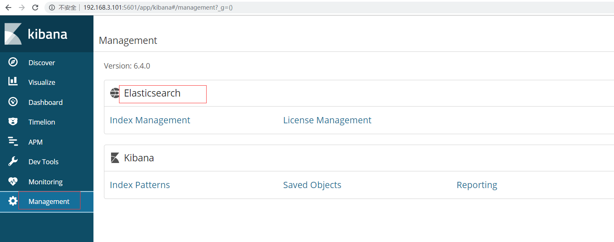
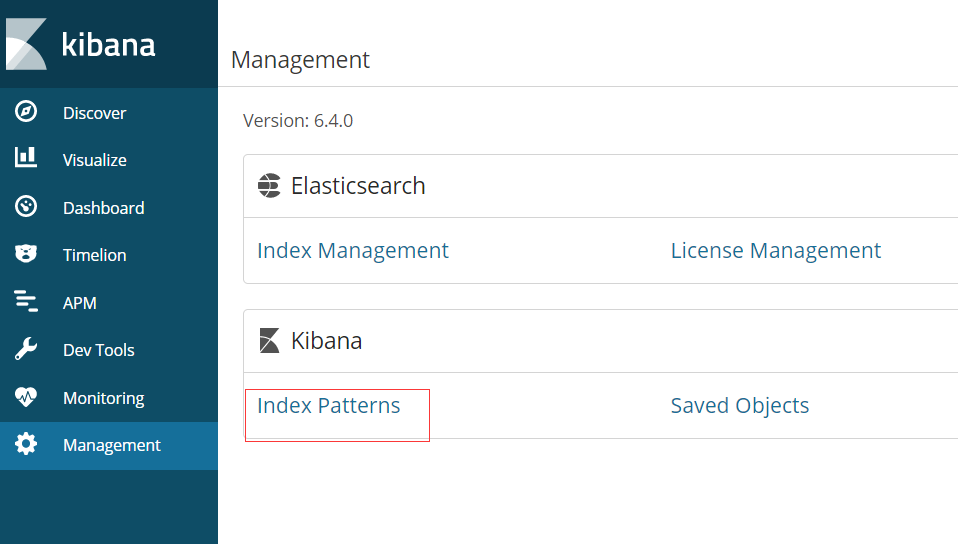
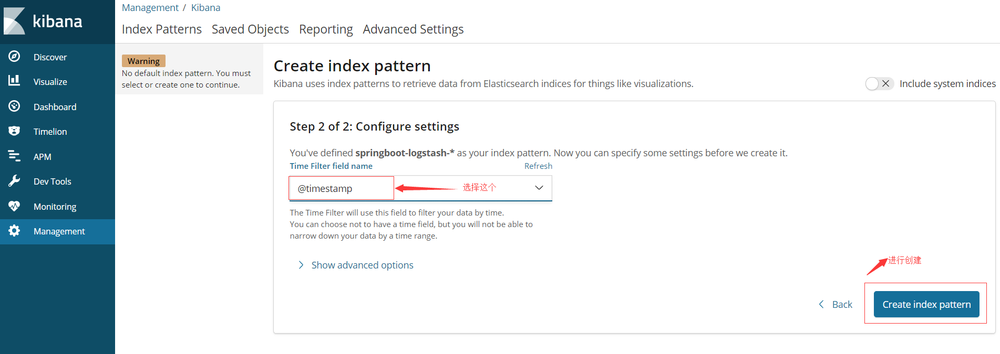

mall项目全套学习教程连载中，[关注公众号](#公众号)第一时间获取。

# SpringBoot应用整合ELK实现日志收集

> ELK即Elasticsearch、Logstash、Kibana,组合起来可以搭建线上日志系统，本文主要讲解使用ELK来收集SpringBoot应用产生的日志。

## 学习前需要了解的内容

- [开发者必备Docker命令](https://mp.weixin.qq.com/s/d_CuljDTJq680NTndAay8g)
- [使用Docker Compose部署SpringBoot应用](https://mp.weixin.qq.com/s/iMl9bJ4SxUsNHBbiS5VUcw)
- [SpringBoot应用中使用AOP记录接口访问日志](https://mp.weixin.qq.com/s/mNujRjejQ1bITveFI6gkcg)

## ELK中各个服务的作用

- Elasticsearch:用于存储收集到的日志信息；
- Logstash:用于收集日志，SpringBoot应用整合了Logstash以后会把日志发送给Logstash,Logstash再把日志转发给Elasticsearch；
- Kibana:通过Web端的可视化界面来查看日志。

## 使用Docker Compose 搭建ELK环境

### 需要下载的Docker镜像

```shell
docker pull elasticsearch:6.4.0
docker pull logstash:6.4.0
docker pull kibana:6.4.0
```

### 搭建前准备

- elasticsearch 启动成功需要特殊配置，具体参考[mall在Linux环境下的部署（基于Docker Compose）](https://mp.weixin.qq.com/s/JYkvdub9DP5P9ULX4mehUw)中的elasticsearch部分；
- docker-compose.yml文件地址:https://github.com/macrozheng/mall-learning/blob/master/mall-tiny-elk/src/main/docker/docker-compose.yml
- logstash-springboot.conf配置文件地址：https://github.com/macrozheng/mall-learning/blob/master/mall-tiny-elk/src/main/docker/logstash-springboot.conf

### 开始搭建

#### 创建一个存放logstash配置的目录并上传配置文件

##### logstash-springboot.conf文件内容
```
input {
  tcp {
    mode => "server"
    host => "0.0.0.0"
    port => 4560
    codec => json_lines
  }
}
output {
  elasticsearch {
    hosts => "es:9200"
    index => "springboot-logstash-%{+YYYY.MM.dd}"
  }
}
```
##### 创建配置文件存放目录并上传配置文件到该目录
```shell
mkdir /mydata/logstash
```

#### 使用docker-compose.yml脚本启动ELK服务

##### docker-compose.yml内容
```yml
version: '3'
services:
  elasticsearch:
    image: elasticsearch:6.4.0
    container_name: elasticsearch
    environment:
      - "cluster.name=elasticsearch" #设置集群名称为elasticsearch
      - "discovery.type=single-node" #以单一节点模式启动
      - "ES_JAVA_OPTS=-Xms512m -Xmx512m" #设置使用jvm内存大小
    volumes:
      - /mydata/elasticsearch/plugins:/usr/share/elasticsearch/plugins #插件文件挂载
      - /mydata/elasticsearch/data:/usr/share/elasticsearch/data #数据文件挂载
    ports:
      - 9200:9200
  kibana:
    image: kibana:6.4.0
    container_name: kibana
    links:
      - elasticsearch:es #可以用es这个域名访问elasticsearch服务
    depends_on:
      - elasticsearch #kibana在elasticsearch启动之后再启动
    environment:
      - "elasticsearch.hosts=http://es:9200" #设置访问elasticsearch的地址
    ports:
      - 5601:5601
  logstash:
    image: logstash:6.4.0
    container_name: logstash
    volumes:
      - /mydata/logstash/logstash-springboot.conf:/usr/share/logstash/pipeline/logstash.conf #挂载logstash的配置文件
    depends_on:
      - elasticsearch #kibana在elasticsearch启动之后再启动
    links:
      - elasticsearch:es #可以用es这个域名访问elasticsearch服务
    ports:
      - 4560:4560
```

##### 上传到linux服务器并使用docker-compose命令运行
```shell
docker-compose up -d
```
注意：Elasticsearch启动可能需要好几分钟，要耐心等待。


#### 在logstash中安装json_lines插件
```shell
# 进入logstash容器
docker exec -it logstash /bin/bash
# 进入bin目录
cd /bin/
# 安装插件
logstash-plugin install logstash-codec-json_lines
# 退出容器
exit
# 重启logstash服务
docker restart logstash
```
#### 开启防火墙并在kibana中查看
```shell
systemctl stop firewalld
```
访问地址：http://192.168.3.101:5601



## SpringBoot应用集成Logstash

### 在pom.xml中添加logstash-logback-encoder依赖
```xml
<!--集成logstash-->
<dependency>
    <groupId>net.logstash.logback</groupId>
    <artifactId>logstash-logback-encoder</artifactId>
    <version>5.3</version>
</dependency>
```

### 添加配置文件logback-spring.xml让logback的日志输出到logstash

> 注意appender节点下的destination需要改成你自己的logstash服务地址，比如我的是：192.168.3.101:4560 。

```xml
<?xml version="1.0" encoding="UTF-8"?>
<!DOCTYPE configuration>
<configuration>
    <include resource="org/springframework/boot/logging/logback/defaults.xml"/>
    <include resource="org/springframework/boot/logging/logback/console-appender.xml"/>
    <!--应用名称-->
    <property name="APP_NAME" value="mall-admin"/>
    <!--日志文件保存路径-->
    <property name="LOG_FILE_PATH" value="${LOG_FILE:-${LOG_PATH:-${LOG_TEMP:-${java.io.tmpdir:-/tmp}}}/logs}"/>
    <contextName>${APP_NAME}</contextName>
    <!--每天记录日志到文件appender-->
    <appender name="FILE" class="ch.qos.logback.core.rolling.RollingFileAppender">
        <rollingPolicy class="ch.qos.logback.core.rolling.TimeBasedRollingPolicy">
            <fileNamePattern>${LOG_FILE_PATH}/${APP_NAME}-%d{yyyy-MM-dd}.log</fileNamePattern>
            <maxHistory>30</maxHistory>
        </rollingPolicy>
        <encoder>
            <pattern>${FILE_LOG_PATTERN}</pattern>
        </encoder>
    </appender>
    <!--输出到logstash的appender-->
    <appender name="LOGSTASH" class="net.logstash.logback.appender.LogstashTcpSocketAppender">
        <!--可以访问的logstash日志收集端口-->
        <destination>192.168.3.101:4560</destination>
        <encoder charset="UTF-8" class="net.logstash.logback.encoder.LogstashEncoder"/>
    </appender>
    <root level="INFO">
        <appender-ref ref="CONSOLE"/>
        <appender-ref ref="FILE"/>
        <appender-ref ref="LOGSTASH"/>
    </root>
</configuration>
```

### 运行Springboot应用


## 在kibana中查看日志信息

### 创建index pattern






### 查看收集的日志


### 调用接口进行测试


### 制造一个异常并查看

#### 修改获取所有品牌列表接口


#### 调用该接口并查看日志


### 总结
搭建了ELK日志收集系统之后，我们如果要查看SpringBoot应用的日志信息，就不需要查看日志文件了，直接在Kibana中查看即可。

## 项目源码地址

[https://github.com/macrozheng/mall-learning/tree/master/mall-tiny-elk](https://github.com/macrozheng/mall-learning/tree/master/mall-tiny-elk)

## 公众号


